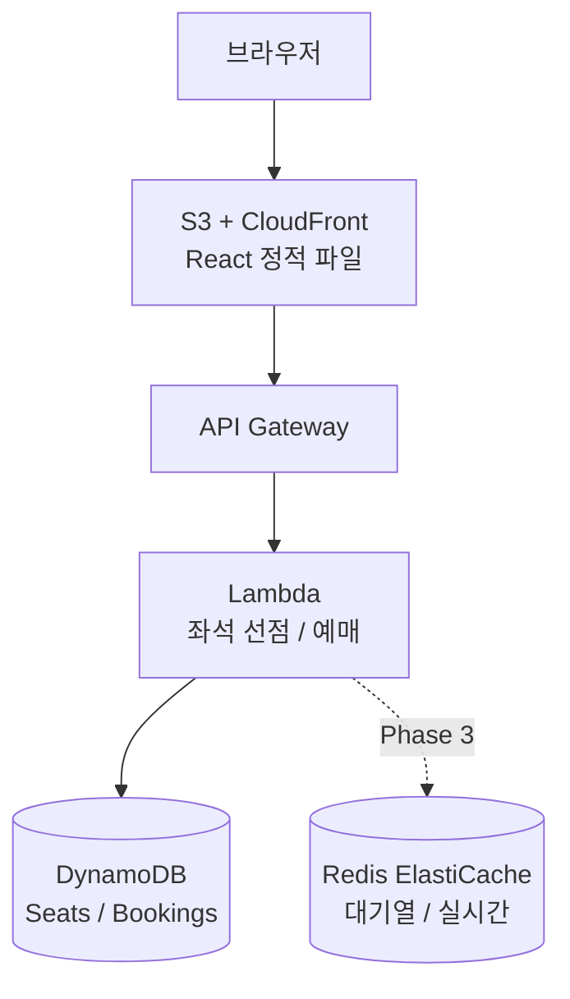

# 티켓팅 연습 페이지 — 아키텍처

## 시스템 구조 (Phase 2 기준)



## Phase 1 구조 (지금 — API 없음)

```
브라우저 → S3 (React SPA)
```

- 메인 페이지: 카운트다운 + 2개 버튼 (UI만)
- 혼자 연습 페이지: 좌석 클릭 → 타이머 측정 (클라이언트 전용)
- 좌석 상태는 프론트에서 랜덤 생성 (mock data)

## Phase 2 구조 (Lambda + DynamoDB 추가)

- 대기열 참여 버튼 활성화
- 좌석 선점 API (DynamoDB 조건부 쓰기로 동시성 처리)
- 예매 확정 API

## 핵심 페이지 흐름

```
메인
 ├── [혼자 연습하기] → /practice
 │     좌석 클릭 → 타이머 시작 → 예약하기 → 시간 결과
 │
 └── [대기열 참여] → /queue (Phase 2)
       대기 중... (N번째) → 라운드 시작 → /competition
         좌석 선택 → 선점 API → 예매 확정 → /booking-complete
```

## 폴더 구조

```
zzemal_ticket/
├── frontend/                  # React + Vite
│   ├── src/
│   │   ├── pages/
│   │   │   ├── MainPage.tsx       # 메인 (카운트다운 + 2버튼)
│   │   │   ├── PracticePage.tsx   # 혼자 연습 (API 없음)
│   │   │   ├── QueuePage.tsx      # 대기열 (Phase 2)
│   │   │   ├── CompetitionPage.tsx # 경쟁 좌석 선택 (Phase 2)
│   │   │   └── BookingCompletePage.tsx
│   │   ├── components/
│   │   │   ├── SeatMap.tsx        # 좌석 배치도
│   │   │   └── Countdown.tsx
│   │   └── lib/
│   │       ├── api.ts             # Lambda API 호출
│   │       └── userId.ts          # localStorage userId
│   └── ...
├── backend/                   # Lambda 함수 (Phase 2)
│   └── src/
│       ├── seats/hold.ts
│       ├── seats/release.ts
│       ├── bookings/create.ts
│       └── queue/join.ts
└── docs/
```

## 핵심 설계 결정

| 결정 | 선택 | 이유 |
|------|------|------|
| 동시성 처리 | DynamoDB 조건부 쓰기 (ConditionExpression) | Redis 없이 서버리스에서 SET NX EX 동일 효과 |
| 배포 | S3 정적 + Lambda | 인프라 관리 최소화 |
| 대기열 | Phase 3으로 이연 | 일단 UI 완성 후 추가 |
| 인증 | localStorage UUID | 로그인 불필요, 심플하게 |

## 데이터 흐름 — 좌석 선점 (Phase 2)

1. 사용자가 좌석 클릭
2. `POST /seats/{id}/hold` — DynamoDB 조건부 쓰기 (status = available인 경우만 held로 변경)
3. 성공 시 "예매 확정" 버튼 표시
4. "예매 확정" → `POST /bookings` — DynamoDB에 Booking 저장
5. 실패 시 (ConditionalCheckFailedException) → "이미 선택된 좌석" 안내
