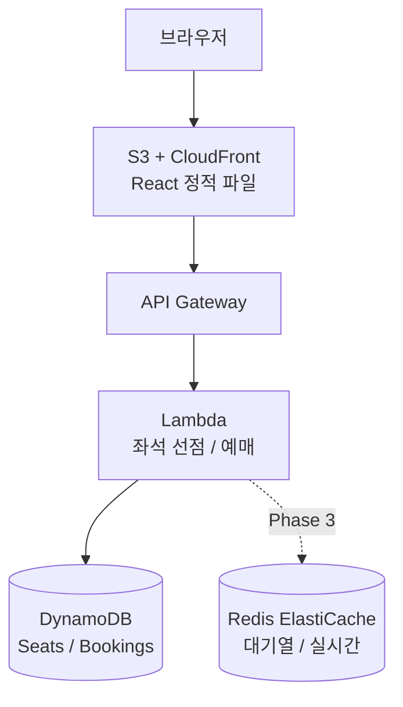

# 티켓팅 연습 페이지 — 아키텍처

## 시스템 구조 (Phase 2 기준)



## Phase 1 구조 (완료 — API 없음)

```
브라우저 → S3 (React SPA)
```

- 4가지 연습 모드 전부 클라이언트 단독 동작
- 좌석 상태는 프론트에서 랜덤 생성 (mock data)
- 대기열은 가짜 번호 카운트다운으로 시뮬레이션

## Phase 2 구조 (Lambda + DynamoDB 추가)

- 실서비스/빠른연습 모드의 대기열을 실제 Redis Queue로 대체
- 좌석 선점 API (DynamoDB 조건부 쓰기로 동시성 처리)
- 예매 확정 API

## 핵심 페이지 흐름

```
메인 (/)
 ├── [실서비스 테스트] → /service-test
 │     standby (5분 카운트다운)
 │     → 대기열 입장 버튼 클릭
 │     → queue (1분 가짜 대기번호)
 │     → selecting (4분 좌석 선택)
 │     → confirming → result
 │
 ├── [대기열 빠른 연습] → /queue-test
 │     standby (1분 카운트다운)
 │     → 대기열 입장 버튼 클릭
 │     → queue (15초 가짜 대기번호)
 │     → selecting (45초 좌석 선택)
 │     → confirming → result
 │
 ├── [대기열 반응속도 연습] → /solo-queue
 │     10초마다 버튼 활성화
 │     → 클릭 반응속도(ms) 측정 → 기록
 │
 └── [좌석 선택 속도 연습] → /solo-seat
       시작 버튼 → 좌석 클릭 → 예매 확정
       → 구간별 소요 시간 측정 → 기록
```

## 폴더 구조

```
zzemal_ticket/
├── frontend/                  # React + Vite
│   ├── src/
│   │   ├── pages/
│   │   │   ├── MainPage.tsx          # 모드 선택 허브
│   │   │   ├── ServiceTestPage.tsx   # 5분 단위 실서비스 테스트
│   │   │   ├── QueueTestPage.tsx     # 1분 단위 빠른 연습
│   │   │   ├── SoloQueuePage.tsx     # 대기열 반응속도 연습
│   │   │   └── SoloSeatPage.tsx      # 좌석 선택 속도 연습
│   │   ├── components/
│   │   │   └── SeatMap.tsx           # 좌석 배치도 컴포넌트
│   │   └── lib/
│   │       ├── roundUtils.ts         # 회차/주기 계산 유틸
│   │       ├── mockData.ts           # 좌석 목업 데이터
│   │       └── api.ts                # Lambda API 호출 (Phase 2)
│   └── ...
├── backend/                   # Lambda 함수 (Phase 2)
│   └── src/
│       ├── seats/hold.ts
│       ├── seats/release.ts
│       ├── bookings/create.ts
│       └── queue/join.ts
└── docs/
```

## 핵심 설계 결정

| 결정 | 선택 | 이유 |
|------|------|------|
| 동시성 처리 | DynamoDB 조건부 쓰기 (ConditionExpression) | Redis 없이 서버리스에서 SET NX EX 동일 효과 |
| 배포 | S3 정적 + Lambda | 인프라 관리 최소화 |
| 대기열 (Phase 1) | 클라이언트 가짜 번호 시뮬레이션 | 백엔드 없이 UX 완성 후 추가 |
| 대기열 (Phase 3) | Redis ElastiCache | 실시간 순번 처리 |
| 인증 | localStorage UUID | 로그인 불필요, 심플하게 |
| 회차 계산 | 로컬 시간 기준 자정~5분 단위 | 한국 사용자 대상, 서버 불필요 |

## 데이터 흐름 — 좌석 선점 (Phase 2)

1. 사용자가 좌석 클릭
2. `POST /seats/{id}/hold` — DynamoDB 조건부 쓰기 (status = available인 경우만 held로 변경)
3. 성공 시 "예매 확정" 버튼 표시
4. "예매 확정" → `POST /bookings` — DynamoDB에 Booking 저장
5. 실패 시 (ConditionalCheckFailedException) → "이미 선택된 좌석" 안내
